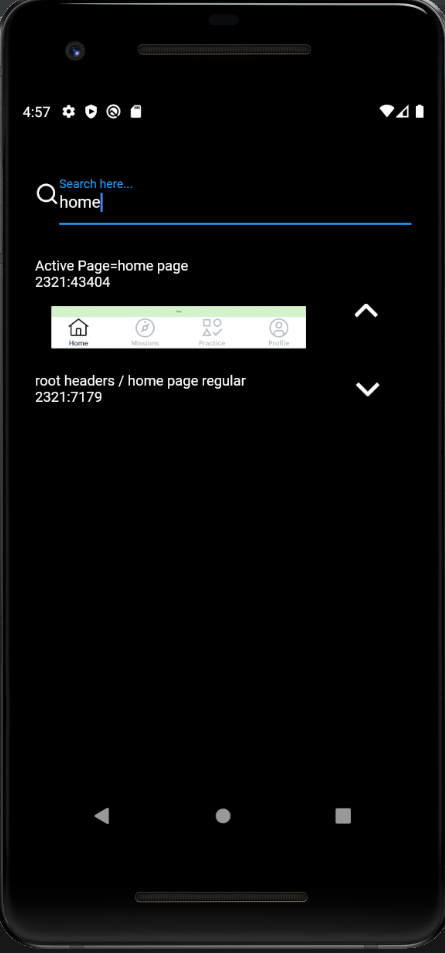

# Figma Flutter Preview
A Figma component preview for your Flutter widget.

It will obtain the png version of the component from Figma and display a half transparent overlay on top of your widget.

## The Purpose
To make sure that code is developed in the way that it’s the same as in design takes a lot of time. Here are the main reasons why:

**Getting Specs**

The developer needs to select each layer and get the specs from each element like the sizes, spacings, colors, and others. It's time-consuming and sometimes we all are making mistakes


**Different Rendering**

We found the issue that text rendering in Flutter is not the same as in Figma. Even if the developer provides the right spacings in the UI there are still some issues after. It's much easier to find visual inconsistencies by just overlaying the final results on top.

## Figma Preparation
To start you will need to install the [Scripter](https://www.figma.com/community/plugin/757836922707087381/Scripter) plugin to your Figma account and run the script that is available [here](https://github.com/vlivanov/flutter_figma_preview/blob/master/insert_component_id.js)

The full overview of how to prepare your Figma file is available in this tutorial on Youtube by Farid Sabitov. And the public Figma file with all the details here.

## How to use
In order to use the FigmaPreview widget you will need to know the Figma API token and your component id.

The component id can be obtained via script insert_component_id.js. You need to run it within your Figma project via [Scripter](https://www.figma.com/community/plugin/757836922707087381/Scripter) Figma plugin. 

Example(MyComponentStory.dart): 

```
FigmaPreview(
    id: '2429:111',
    fileId: '123',
    figmaToken: '456',
    child: MyComponent()
)
```

Works best in a separate app target, like this: 
```
void main() {
  runApp(MaterialApp(
      home: MyComponentStory()));
}
```

## How to search component ids

Use FigmaSearchComponent on a separate page. It allows to search for components in your project and display 
a title, a preview and a component id. It also allows to filter a component by name.

```
FigmaSearchComponent(fileId: '123', figmaToken: 'aa-bb-cc')
``` 


